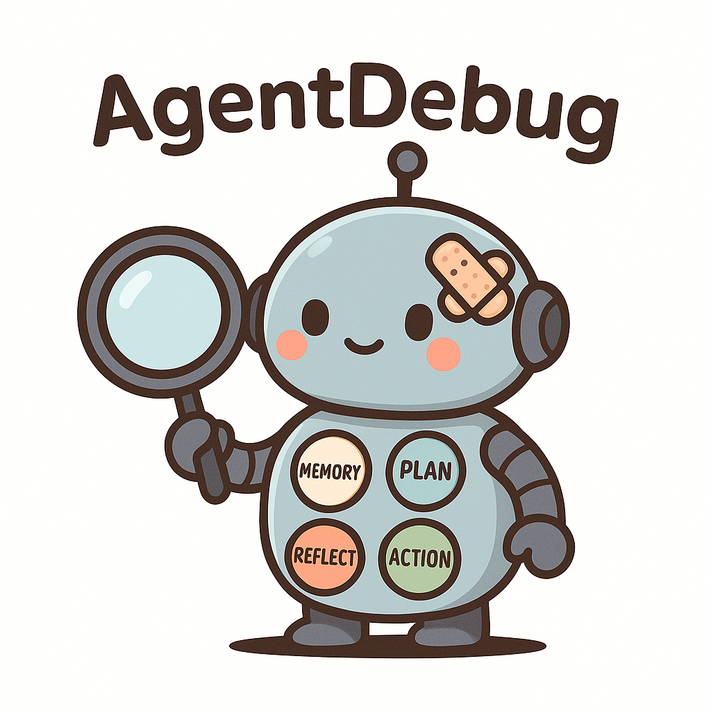

# AgentDebug 🔍🤖

<div align="center">
  

  **Where LLM Agents Fail and How They Can Learn From Failures**

  [](https://arxiv.org/abs/2509.25370)
  [](https://drive.google.com/drive/folders/1bQe6dQA85pktT63YnKIKJDTVaH3O3Vpu?usp=drive_link)
  [](LICENSE)
</div>

## 📊 AgentErrorBench Dataset

Access our comprehensive benchmark dataset of systematically annotated failure trajectories:

🔗 **[Download AgentErrorBench](https://drive.google.com/drive/folders/1bQe6dQA85pktT63YnKIKJDTVaH3O3Vpu?usp=drive_link)**

AgentErrorBench contains 200 expertly annotated agent failure trajectories across three environments:
- **GAIA**: 50 trajectories from general AI assistant tasks
- **ALFWorld**: 100 trajectories from embodied agent tasks
- **WebShop**: 50 trajectories from web navigation and shopping tasks

## 📖 About

Large Language Model (LLM) agents have shown remarkable capabilities in solving complex, multi-step tasks through sophisticated architectures integrating planning, memory, reflection, and tool-use modules. However, these complex systems are vulnerable to cascading failures, where a single root-cause error propagates through subsequent decisions, ultimately leading to task failure.

**AgentDebug** introduces a principled framework for understanding, detecting, and recovering from agent failures through three key contributions:

1. **AgentErrorTaxonomy** 📋: A modular classification system categorizing failure modes across memory, reflection, planning, action, and system-level operations.

2. **AgentErrorBench** 🎯: The first comprehensive dataset of systematically annotated failure trajectories from real-world agent rollouts in ALFWorld, GAIA, and WebShop environments.

3. **AgentDebug Framework** 🛠️: An intelligent debugging system that isolates root-cause failures and provides targeted corrective feedback, enabling agents to recover and iteratively improve.

## 🚀 Key Results

Our experiments demonstrate that AgentDebug significantly improves agent reliability:

- **24% higher** all-correct accuracy compared to the strongest baseline
- **17% higher** step accuracy in error detection
- **Up to 26%** relative improvement in task success rates through iterative recovery
- Effective across diverse environments (ALFWorld, GAIA, WebShop)

## 🏗️ Architecture

The AgentDebug framework consists of a two-stage analysis pipeline:

### Stage 1: Fine-Grained Analysis
Performs detailed step-by-step analysis of agent trajectories to identify potential error patterns at each decision point.

### Stage 2: Critical Error Detection
Identifies the critical failure point that led to task failure and provides root cause analysis with targeted feedback.

## 📁 Repository Structure

```
AgentDebug/
├── detector/              # Core detection and analysis framework
│   ├── fine_grained_analysis.py    # Stage 1: Step-level error detection
│   ├── critical_error_detection.py # Stage 2: Critical failure identification
│   ├── error_definitions.py        # Comprehensive error taxonomy
│   └── AgentErrorBench/           # Benchmark dataset structure
│       ├── Label/                  # Annotated error labels
│       └── Original_Failure_Trajectory/ # Raw agent trajectories
└── README.md
```

## 🔧 Installation

```bash
git clone https://github.com/ulab-uiuc/AgentDebug.git
cd AgentDebug
pip install -r requirements.txt
```

## 💡 Quick Start

```python
from detector import fine_grained_analysis, critical_error_detection

# Load your agent trajectory
trajectory = load_agent_trajectory("path/to/trajectory.json")

# Stage 1: Analyze potential errors at each step
step_errors = fine_grained_analysis.analyze(trajectory)

# Stage 2: Identify critical failure point
critical_failure = critical_error_detection.detect(trajectory, step_errors)

# Get corrective feedback
feedback = critical_failure.generate_feedback()
```

## 📊 Error Taxonomy

Our comprehensive error taxonomy covers five key modules:

| Module | Error Types | Examples |
|--------|------------|----------|
| **Memory** | Hallucination, Retrieval Failure, Over-simplification | Agent forgets visited locations |
| **Reflection** | Progress Misjudgment, Outcome Misinterpretation | Incorrect assessment of task progress |
| **Planning** | Inefficient Planning, Constraint Ignorance | Selecting impossible actions |
| **Action** | Format Errors, Parameter Errors, Misalignment | Invalid action syntax |
| **System** | Step Limits, Tool Failures, Environment Errors | Exceeding maximum steps |

## 📈 Performance

AgentDebug achieves state-of-the-art performance in error detection and recovery:

| Metric | Improvement |
|--------|------------|
| All-Correct Accuracy | +24% |
| Step Accuracy | +17% |
| Task Success Rate | Up to +26% |

## 📝 Citation

If you use AgentDebug in your research, please cite our paper:

```bibtex
@article{agentdebug2024,
  title={Where LLM Agents Fail and How They Can Learn From Failures},
  author={Author Names},
  journal={arXiv preprint arXiv:2509.25370},
  year={2024}
}
```

## 📄 License

This project is licensed under the MIT License - see the [LICENSE](LICENSE) file for details.

## 🤝 Contributing

We welcome contributions! Please feel free to submit issues, create pull requests, or reach out for collaborations.

## 📧 Contact

For questions and support, please open an issue on this repository.

---

<div align="center">
  <sub>Built with ❤️ by the ULAB team at UIUC</sub>
</div>