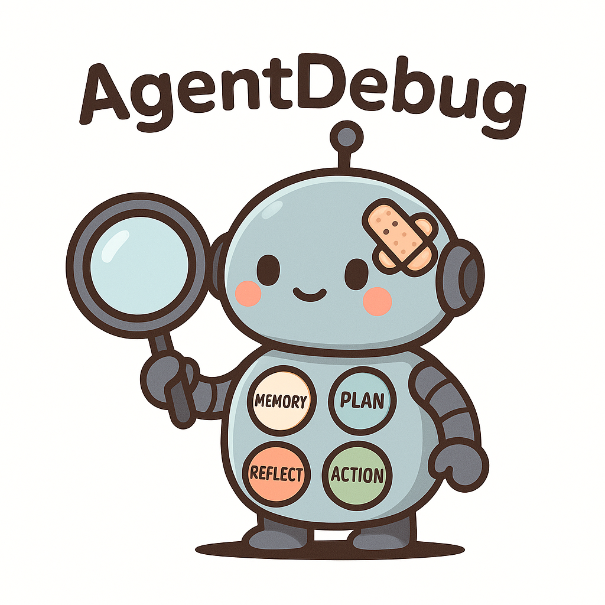

<div align="center">
  

  **Where LLM Agents Fail and How They Can Learn From Failures**

  [](https://arxiv.org/abs/2509.25370)
  [](https://drive.google.com/drive/folders/1bQe6dQA85pktT63YnKIKJDTVaH3O3Vpu?usp=drive_link)
  [](LICENSE)
</div>

# AgentDebug

AgentDebug is a framework for understanding, detecting, and recovering from LLM agent failures. It provides:

1. **AgentErrorTaxonomy**: A classification system covering 17 error types across 5 modules (memory, reflection, planning, action, system).
2. **AgentErrorBench**: Annotated failure trajectories from ALFWorld, GAIA, and WebShop environments.
3. **AgentDebug Framework**: A two-stage debugging pipeline that isolates root-cause failures and provides corrective feedback.

## Installation

```bash
git clone https://github.com/ulab-uiuc/AgentDebug.git
cd AgentDebug
pip install -e .
```

### Environment Setup

AgentDebug includes vendored environments (ALFWorld, WebShop, GAIA) with modular agent prompts. The rollout system requires these environments to be functional.

**API Keys**: Set the following environment variables (or put them in a `.env` file):

```bash
export OPENAI_API_KEY="..."
export ANTHROPIC_API_KEY="..."      # optional
export GEMINI_API_KEY="..."         # optional
export TOGETHER_API_KEY="..."       # optional
```

## Repository Structure

```
AgentDebug/
├── agentdebug/
│   ├── detector/              # Core error detection framework
│   │   ├── fine_grained_analysis.py    # Phase 1: step-level per-module error detection
│   │   └── critical_error_detection.py # Phase 2: critical error identification
│   ├── taxonomy/              # Error type definitions (5 modules, 17 types)
│   ├── engines/               # Multi-provider LLM abstraction
│   │   ├── openai.py          # OpenAI (GPT-4o, GPT-4.1, etc.)
│   │   ├── anthropic.py       # Anthropic (Claude)
│   │   ├── gemini.py          # Google (Gemini)
│   │   └── together.py        # Together AI (Llama, Qwen, etc.)
│   ├── environments/          # Environment wrappers + modular prompts
│   │   ├── alfworld/          # ALFWorld embodied tasks
│   │   ├── webshop/           # WebShop e-commerce tasks
│   │   └── gaia/              # GAIA general AI assistant tasks
│   └── rollout/               # Trajectory collection
│       ├── rollout.py         # Unified rollout across all environments
│       └── step_to_episode.py # Step-level → episode-level conversion
├── detector/                  # Original detector (standalone, no dependencies)
├── examples/                  # Sample data and demo scripts
└── docs/                      # Documentation
```

## Quick Start

### Run the Detector on a Trajectory

```python
from detector.fine_grained_analysis import ErrorTypeDetector
from detector.critical_error_detection import CriticalErrorAnalyzer

# Configure with your API key
api_config = {
    "base_url": "https://api.openai.com/v1/chat/completions",
    "api_key": "your-api-key",
    "model": "gpt-4o-mini",
    "temperature": 0.0,
    "max_retries": 3,
    "timeout": 60,
}

# Phase 1: Step-level error detection
detector = ErrorTypeDetector(api_config)
trajectory_data = detector.parse_trajectory("path/to/trajectory.json")
phase1_results = await detector.analyze_trajectory(trajectory_data)

# Phase 2: Critical error identification
analyzer = CriticalErrorAnalyzer(api_config)
critical_error = await analyzer.identify_critical_error(phase1_results, trajectory_data)
```

### Collect Rollout Trajectories

```bash
# AlfWorld rollout with Together AI (cheap, fast)
python -m agentdebug.rollout.rollout \
  --env alfworld \
  --provider together \
  --model meta-llama/Llama-3.3-70B-Instruct-Turbo \
  --unique_envs \
  --total_envs 100 \
  --concurrency 4 \
  --dump_path output/alfworld_steps.jsonl

# Convert steps to episodes
python -m agentdebug.rollout.step_to_episode \
  --input_jsonl output/alfworld_steps.jsonl \
  --output_jsonl output/alfworld_episodes.jsonl
```

### Multi-Provider LLM Engine

```python
from agentdebug.engines import create_chat_model

# Automatically routes to the correct provider based on model name
model = create_chat_model("gpt-4o-mini")                          # → OpenAI
model = create_chat_model("claude-sonnet-4-6")                   # → Anthropic
model = create_chat_model("gemini-2.5-flash")                     # → Gemini
model = create_chat_model("meta-llama/Llama-3.3-70B-Instruct-Turbo")  # → Together

response = model("What is 2+2?")
```

## Error Taxonomy

| Module | Error Types | Description |
|--------|------------|-------------|
| **Memory** | hallucination, memory_retrieval_failure, over_simplification | Agent misremembers or fails to recall information |
| **Reflection** | progress_misjudge, outcome_misinterpretation, causal_misattribution, hallucination | Agent incorrectly evaluates its own progress |
| **Planning** | constraint_ignorance, impossible_action, inefficient_plan | Agent creates flawed plans |
| **Action** | misalignment, invalid_action, format_error, parameter_error | Agent executes wrong actions |
| **System** | step_limit, tool_execution_error, llm_limit, environment_error | External system failures |

## AgentErrorBench Dataset

Download annotated failure trajectories:
[AgentErrorBench on Google Drive](https://drive.google.com/drive/folders/1bQe6dQA85pktT63YnKIKJDTVaH3O3Vpu?usp=drive_link)

- **ALFWorld**: 100 trajectories from embodied agent tasks
- **GAIA**: 50 trajectories from general AI assistant tasks
- **WebShop**: 50 trajectories from web navigation tasks

## Key Results

| Metric | Improvement |
|--------|------------|
| All-Correct Accuracy | +24% |
| Step Accuracy | +17% |
| Task Success Rate | Up to +26% |

## Citation

```bibtex
@article{agentdebug2025,
  title={Where LLM Agents Fail and How They Can Learn From Failures},
  author={Zhu, Kunlun and Liu, Zijia and Li, Bingxuan and Tian, Muxin and Yang Yingxuan and Zhang, Jiaxun and others},
  journal={arXiv preprint arXiv:2509.25370},
  year={2025}
}
```

## License

This project is licensed under the MIT License - see the [LICENSE](LICENSE) file for details.

## Contributing

We welcome contributions! Please feel free to submit issues, create pull requests, or reach out for collaborations.
